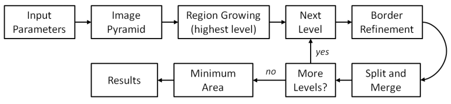
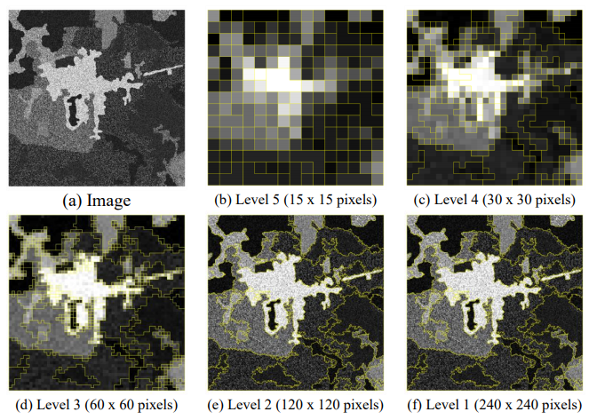
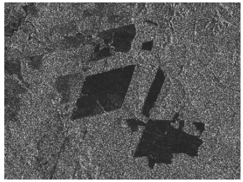
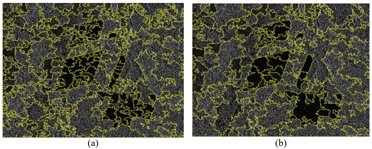
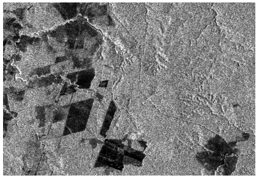
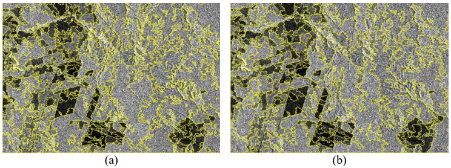

## MultiSeg - Hierarchical segmentation algorithm for radar and optical data

### What is MultiSeg?

MultiSeg consists on a specialized segmentation technique devised for SAR (Synthetic Aperture Radar) and optical imagery. Initially, images are compressed at different rates creating an image pyramid, then a region growing procedure is used in combination with a split and merge technique at the different compression levels. In sequence, the program processes the image pyramid from the coarser to the finer compression levels, applying a border refinement heuristic each time it changes from one level to the next.

Created in the C++ language, with the support from the open-source library [TerraLib](http://www.dpi.inpe.br/terralib5/wiki/doku.php).
The devised software architecture permits easy extension of its capabilities.

### Methodology

The algorithm integrates several segmentation strategies, which iteratively process data structured as an image pyramid.


|:--:|
| Processing Chain |

 Figure illustrates the segmentation process at different compression levels.
 

|:--:| 
| (a) Synthetic radar image and (b)-(f) final segments computed for each level,<br/>superimposed with the respective compressed image. |

### Architecture

Code design was oriented towards a modular and extendable architecture, which can easily accommodate new mechanisms in the segmentation process, or improvements of the current ones.

Possibility of seamlessly incorporating new rules and tests for the segmentation process, without the need for modifications of the structural, generic, classes that compose the architecture of MultiSeg. Therefore, in order to extend the code in that
sense, it suffices to create new classes that implement the **AbstractMerger interface**.

```cpp
virtual bool predicate(Region* r1, Region* r2, const std::size_t& band) const = 0;
virtual double getDissimilarity(const std::vector<double>& p, Region* r, const std::size_t& band) const = 0;
virtual bool isHomogenous(Region* r, const std::size_t& band) const = 0;
virtual void merge(Region* r1, Region* r2) const = 0;
```

### Results

We will show a few examples of segmentation results obtained with MultiSeg over SAR data, and the effect of varying the user defined parameters, which are described below:
* *N*: number of compression levels.
* *simil*: similarity threshold (dB) for decision on region growing/merging.
* *conf*: confidence level (%) for decision on region growing/merging and homogeneity hypotheses tests.
* *nel*: number of equivalent looks of original image.
* *mas*: minimum area size (pixels) of final regions.

Although MultiSeg is able to process multiband images, in order to make it easier for the reader to analyze the segmentation results, the examples presented below show the results of the segmentation of a single image band (polarization).


|:--:| 
| Original RADARSAT image (VH polarization). |


|:--:| 
| MultiSeg segmentation of the RADARSAT image:<br/>(a) N=6; simil=1.0; conf=0.95; nel=1.0; mas=20 and (b) N=6; simil=1.0; conf=0.995; nel=1.0; mas=20. |


|:--:| 
| Original ALOS/PALSAR image (HH polarization). |


|:--:|
| MultiSeg segmentation of the ALOS/PALSAR image:<br/>(a) N=3; simil=1.0; conf=0.95; nel=3.0; mas=20 and (b) N=4; simil=1.0; conf=0.95; nel=3.0; mas=20. | 

### References

UBA, D. M.; DUTRA, L. V.; SOARES, M. D.; COSTA, G. A. O. P. Implementation of a hierarchical segmentation algorithm for radar and optical data using TerraLib. In: SIMPÓSIO BRASILEIRO DE SENSORIAMENTO REMOTO, 17. (SBSR), 2015, João Pessoa. Anais... São José dos Campos: INPE, 2015. p. 4041-4048. Internet. ISBN 978-85-17-0076-8. Available from: [Link](http://urlib.net/rep/8JMKD3MGP6W34M/3JM4CC8).

COSTA, G.; DUTRA, L. V.; UBA, D. M.; SOARES, M.; FEITOSA, R.; ROSA, R. MultiSeg: a hierarchical segmentation algorithm for radar and optical data. In: INTERNATIONAL CARTOGRAPHIC CONFERENCE, 27., , Rio de Janeiro, RJ. 2015.

SOUSA JÚNIOR, M. A. Segmentação multi-níveis e multi-modelos para imagens de radar e ópticas. 2005. 131 p. (INPE-14466-TDI/1147). Tese (Doutorado em Computação Aplicada) - Instituto Nacional de Pesquisas Espaciais (INPE), São José dos Campos, 2005. Available from: [Link](http://urlib.net/rep/6qtX3pFwXQZ3P8SECKy/Gk4Ky).
